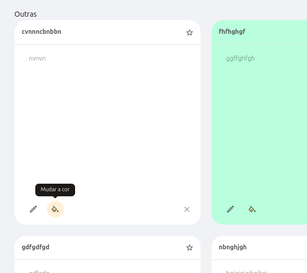
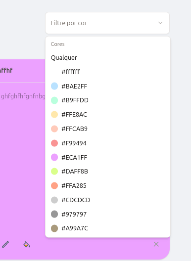
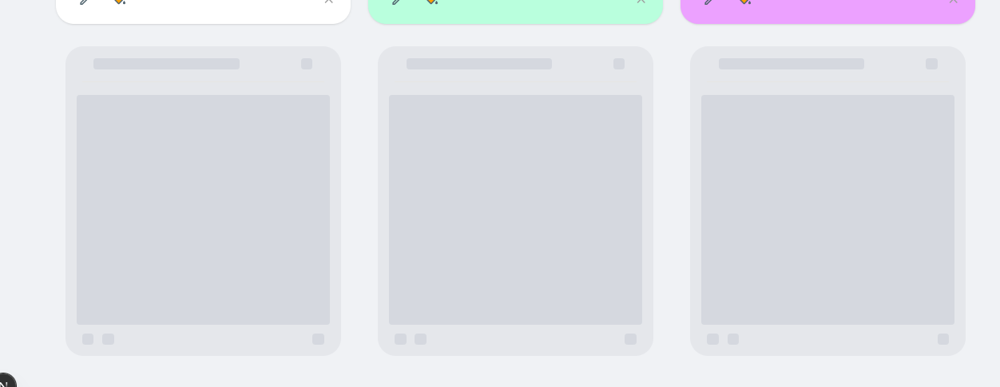
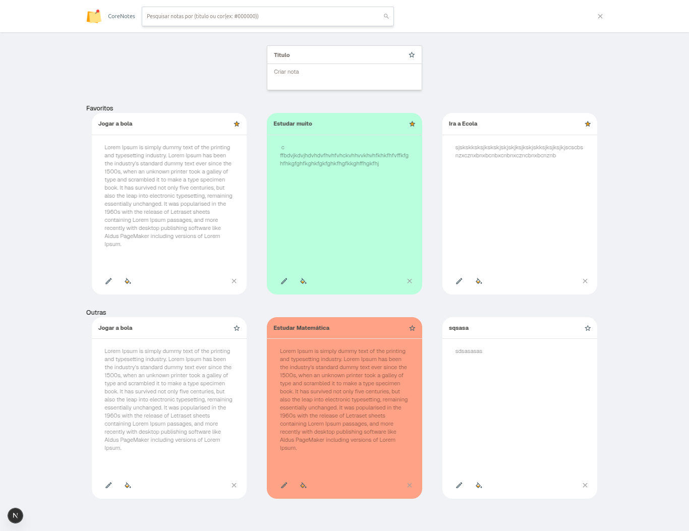

# 📦 Descrição - Lista de tarefas App

Este Pull Request apresenta a entrega completa de uma sistema web voltado para o gerenciamento de listas de tarefas. O sistema foi planejado com foco em usabilidade, organização visual e escalabilidade técnica, tanto no front quanto no back-end, seguindo boas práticas de desenvolvimento moderno.

## 💻 Frontend

No cliente, utilizei **React com Next.js** e **TypeScript**, combinando tipagem forte, renderização eficiente e excelente performance. A construção da interface foi pensada com a abordagem **Mobile First**, priorizando a experiência do usuário em dispositivos móveis e garantindo uma interface responsiva e adaptável a diferentes tamanhos de tela.

O projeto foi estilizado com **Tailwind CSS**, que trouxe agilidade e precisão no desenvolvimento visual, e com **Shadcn UI** para a criação de componentes reutilizáveis e acessíveis. As interações com a API foram feitas através da biblioteca **Axios**, e toda a estrutura de formulários foi construída com **React Hook Form** e validada usando **Zod**, garantindo segurança e fluidez na entrada de dados.

Para o gerenciamento de estado global, utilizei **Zustand**, uma biblioteca leve e eficiente, que se mostrou ideal para manter o estado da lista de tarefas sincronizado com a interface de forma simples e performática.

Outro destaque do frontend foi a atenção à **tipagem rigorosa com TypeScript**. Todas as interfaces e tipos foram definidos com clareza, o que contribuiu diretamente para a robustez da aplicação e facilitou o desenvolvimento colaborativo e a manutenção futura.

Adicionei no projecto também recursos como tolltips, para melhor descrição das funcionalidades, adicionei um componente que permite filtrar por cor das notas. 

### 🦴 Skeletons de Carregamento

Para melhorar a experiência do usuário durante a carga dos dados, Eu adicionei um **sistema de skeletons (esqueletos de carregamento)** nos cards das tarefas. Isso garante um feedback visual imediato ao usuário enquanto as informações são carregadas da API, evitando a sensação de lentidão ou tela vazia.

Esses skeletons foram desenvolvidos utilizando os componentes do **Shadcn**, com animação sutil e estilização integrada ao tema visual da aplicação. Essa funcionalidade melhora a percepção de performance e dá um ar mais profissional à aplicação.

## 🔧 Backend

No lado do servidor, optei por utilizar **Node.js** com o framework **AdonisJS (TypeScript)** por oferecer uma estrutura robusta e com forte adoção do padrão MVC. Essa escolha garantiu organização no código, facilidade de manutenção e integração simplificada com banco de dados e serviços auxiliares.

A base de dados escolhida foi o **Mysql**. Utilizei migrations para controle da estrutura de tabelas e mantive a separação clara entre modelos, controladores e rotas da aplicação.

As rotas da API foram definidas seguindo o padrão RESTful, oferecendo endpoints específicos para cada operação: criação, leitura, atualização e exclusão de tarefas. Além disso, foram adicionadas funcionalidades para **marcar tarefas como favoritas** e **atribuir cores personalizadas** a cada item, tudo devidamente estruturado e validado.

O ambiente de desenvolvimento foi configurado com versões específicas de **Node.js** e **PNPM**, garantindo consistência e reprodutibilidade em diferentes máquinas e etapas do ciclo de vida do projeto. A padronização do backend se manteve em torno do uso exclusivo do **AdonisJS com TypeScript**, mantendo o foco e a coerência técnica.

## 🧪 Desafios e Soluções

Durante a implementação, enfrentei alguns desafios técnicos e de UI. Um dos destaques foi a necessidade de customizar  **as Divs** para seleção de cores, algo que exigiu ajustes finos de acessibilidade e estilização.

Outro ponto desafiador foi garantir a ordenação das tarefas, priorizando os **favoritos no topo da lista**, mesmo após operações de atualização ou exclusão. Isso foi resolvido com lógica eficiente tanto no frontend quanto no backend, mantendo a fluidez da interface.

