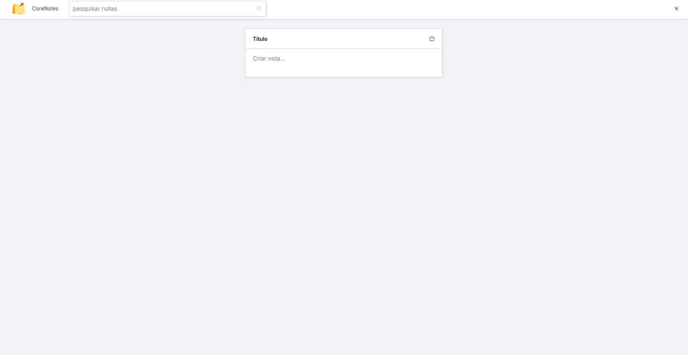

<p align="center">
  
</p>

# 🚀 Desafio Técnico — Front-End (React.js) | Corelab

Este projeto foi desenvolvido como parte do desafio técnico para a vaga de Desenvolvedor(a) Front-End na **Corelab**. O objetivo foi transformar um layout em uma aplicação funcional utilizando React.js com TypeScript, Styled Components, Context API e integração com uma API fake de anotações.

## 🎨 Layout no Figma

Acesse o layout através deste link:

[Figma - Corelab](https://www.figma.com/design/sQrUVHTlyogq3qGdkqGTXN/mockup?node-id=0-1&p=f&t=X4UPzLfiJK0XTd2V-0)

## 🧩 Estrutura do Projeto

O projeto é dividido em duas pastas principais:

- **corelab-api-challenge** → Backend (Node.js + Express + NeonDB)
- **corelab-web-challenge** → Frontend (React + TypeScript + Vite)

---

## 📁 Estrutura de Diretórios

### Backend (`corelab-api-challenge`)

```txt
src/
├── controllers/ # Controladores das rotas
│ └── note.controller.ts
├── db/ # Configuração do banco de dados
│ └── client.ts
├── routes/ # Rotas da API
│ └── note.routes.ts
├── services/ # Lógica de negócio
│ └── note.service.ts
├── types/ # Tipos utilizados
│ └── note.ts
├── index.ts # Inicialização do servidor
```

### Frontend (`corelab-web-challenge`)

```txt
src/
├── assets/ # Imagens e ícones
├── components/ # Componentes reutilizáveis
│ ├── FavoriteNotes/
│ ├── Header/
│ ├── NewNote/
│ ├── Note/
│ └── OthersNotes/
├── contexts/ # Contexto global com API de notas
│ ├── NotesContext.tsx
│ └── useNote.ts
├── lib/ # Funções auxiliares
│ └── utils.ts
├── pages/ # Páginas principais
│ └── Dashboard/
│ ├── index.tsx
│ └── style.ts
├── routes/ # Sistema de rotas
│ └── Router.tsx
├── App.tsx # Componente raiz
├── main.tsx # Ponto de entrada da aplicação
```

## 📦 Instalação e Execução

### 🔧 Pré-requisitos

- Node.js (versão 16 ou superior)
- npm

---

## 🚀 Tecnologias Utilizadas

### 🔧 Backend

- Node.js
- Express
- TypeScript
- NeonDB
- pg (node-postgres)

### 🎨 Frontend

- React.js
- TypeScript
- Styled-Components
- Context API
- Phosphor Icons
- Axios
- Vite

---

## 📦 Instalação

### 🖥️ Backend (API)

```bash
cd corelab-api-challenge
git switch feat/corenotes
npm install
npm run dev
```

### 🖥️ Frontend

```bash
cd corelab-web-challenge
git switch feat/corenotes
npm install
npm run dev
```

Acesse no navegador: http://localhost:5173

### ✨ Funcionalidades
✅ Criar nova nota com título, descrição, cor e favorito
✅ Editar nota diretamente pelo card
✅ Remover nota com confirmação
✅ Marcar/desmarcar como favorita
✅ Escolher cor da nota
✅ Buscar notas por título ou descrição
✅ Separação visual de notas favoritas e outras
✅ Persistência de dados na API

### 🧠 Gerenciamento de Estado
Toda a lógica (buscar, criar, editar, excluir, favoritar, mudar cor) está centralizada no NotesContext, facilitando o acesso e a consistência de dados em toda a aplicação.

### 🔒 Organização das Notas
As notas favoritas são destacadas com o ícone de estrela e listadas separadamente.
As demais notas são exibidas em "Outras notas".